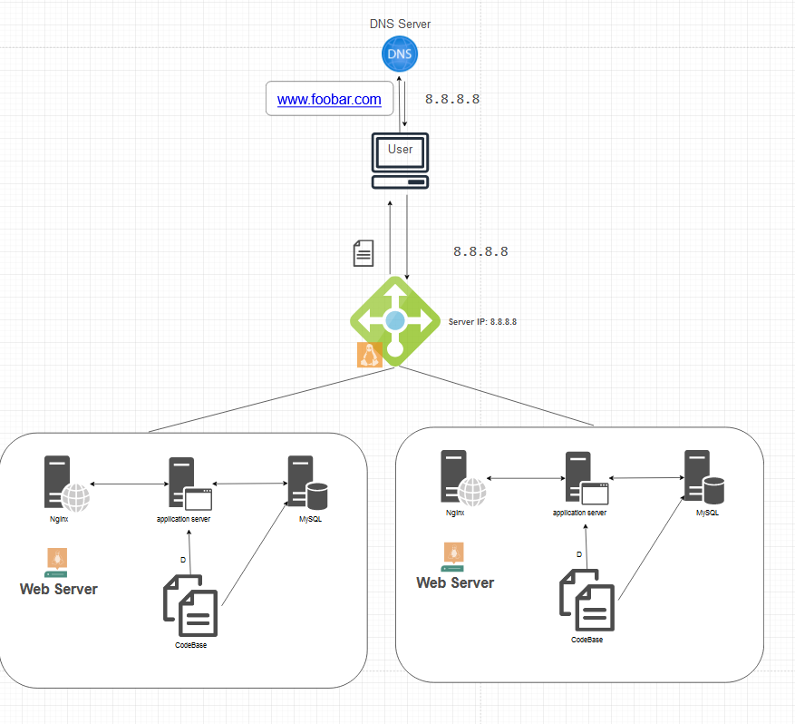

# Distributed Web Infrastructure

## Descriptioni
## Enhanced Overview of Distributed Web Infrastructure

### Load Balancer Configuration

The distributed web infrastructure employs the HAProxy load balancer, utilizing the *Round Robin* distribution algorithm. This dynamic algorithm ensures fair load distribution among servers, adjusting weights on the fly. Each server, including the primary and replica, is utilized in turns based on their weights, maintaining an evenly distributed processing time.

### Load-Balancer Enabled Setup

The load balancer facilitates an *Active-Passive* setup, where one node actively processes workloads while the other remains on standby. Unlike an *Active-Active* setup, this configuration optimizes resource usage by having only one active node at a time. Transition between nodes occurs when the active node becomes inactive, ensuring continuous service availability.

### Database Primary-Replica Cluster Dynamics

The database operates on a *Primary-Replica* (*Master-Slave*) cluster model. The primary server handles both read and write operations, while the replica server exclusively manages read requests. Synchronization of data occurs when the primary server executes write operations, ensuring data consistency between the two servers.

### Role Distinction: Primary vs. Replica

In the application context, the *Primary* node is responsible for executing write operations on the site. In contrast, the *Replica* node specializes in processing read operations, alleviating read traffic from the *Primary* node and contributing to overall system efficiency.

## Identified Infrastructure Challenges

### Single Points of Failure (SPOF)

The infrastructure faces multiple Single Points of Failure (SPOF). For instance, if the Primary MySQL database server experiences downtime, the entire site loses the ability to make changes. Additionally, both the server hosting the load balancer and the application server connecting to the primary database are potential points of failure.

### Security Concerns

The absence of SSL encryption for transmitted data poses a significant security risk, potentially exposing network traffic to unauthorized access. Furthermore, the lack of a firewall across all servers leaves the infrastructure vulnerable to unauthorized IP access.

### Monitoring Gap

A critical concern is the absence of a monitoring system, preventing real-time assessment of server statuses. Implementing a monitoring solution would provide insights into the health and performance of each server, enabling proactive issue resolution and optimization.
