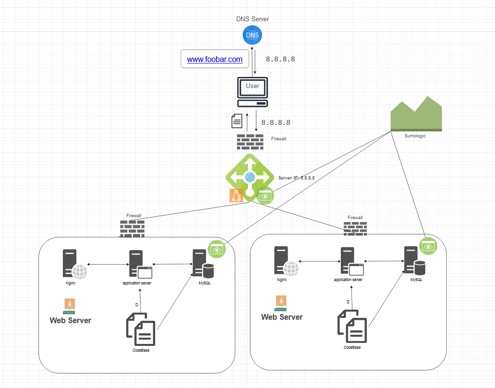

# Secured and Monitored Web Infrastructure

## Description

Three-Server Web Infrastructure: Security, Monitoring, and Encrypted Traffic
In the realm of web hosting, this infrastructure thrives on a robust foundation, emphasizing security, continuous monitoring, and the encryption of all transmitted data.
Noteworthy Aspects of the Infrastructure
* Firewall Deployment: The role of firewalls here extends beyond mere defense; these guardians shield the web servers from unauthorized access. Positioned as intermediaries between internal and external networks, these firewalls actively filter incoming traffic, fortifying the overall security of the web servers.
* SSL Certificate Implementation: Encryption takes center stage with the SSL certificate, securing the communication channel between web servers and the external network. Beyond shielding against potential threats like man-in-the-middle attacks, these certificates ensure the privacy, integrity, and identification of transmitted data.
* Monitoring Client Operation: Operating as vigilant overseers, monitoring clients scrutinize server performance and network health. Their analytical prowess extends to key metrics, automated tests for server accessibility, and the detection of anomalies such as corrupted files or security vulnerabilities. Administrators receive real-time alerts, ensuring proactive responses to any performance deviations.
Challenges Inherent in the Infrastructure
* SSL Termination Complexity: The termination of SSL at the load balancer introduces a nuanced challenge, potentially exposing the traffic between the load balancer and web servers to security risks. This necessitates careful consideration of data integrity during this segment of the transmission.
* Single MySQL Server Concerns: The reliance on a solitary MySQL server poses scalability risks and introduces a potential single point of failure. To bolster the infrastructure's resilience, exploring more scalable and fault-tolerant database configurations is prudent.
* Resource Contention in Homogeneous Servers: The uniformity in server components, while streamlined, introduces the risk of resource contention. This contention, whether for CPU, memory, or I/O resources, can lead to suboptimal performance. Identifying the root cause of issues becomes challenging, compounded by the lack of inherent scalability in this setup.

