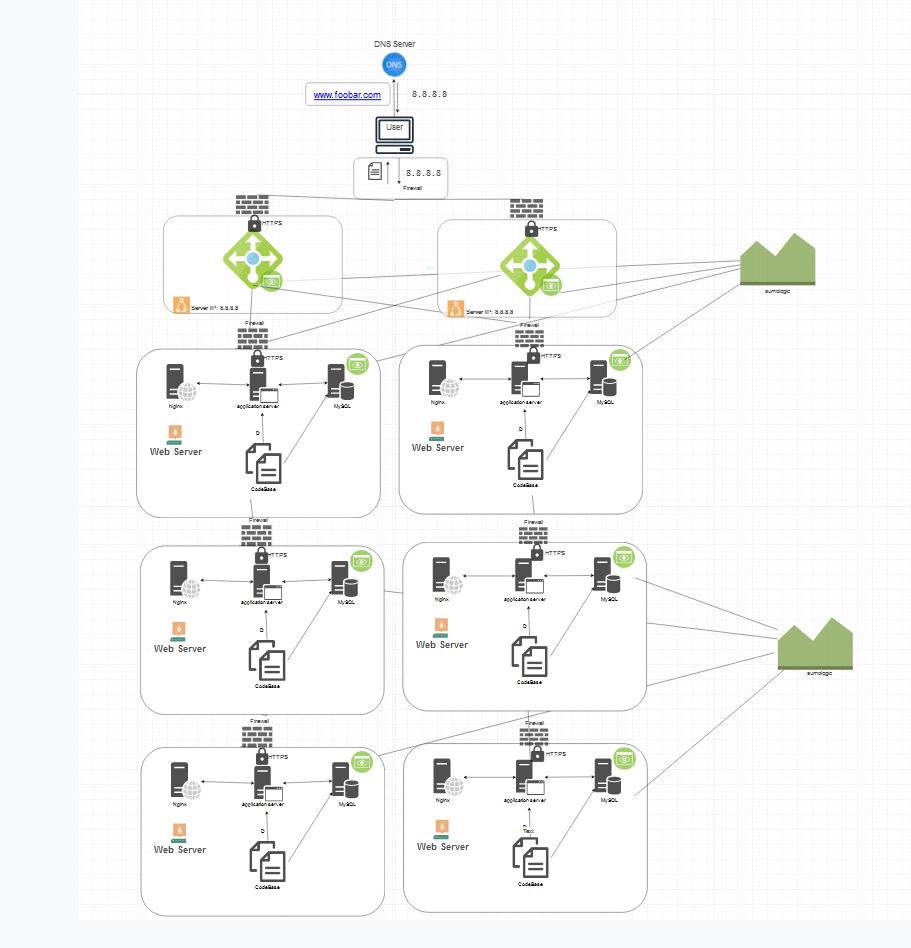

# Scaled Up Web Infrastructure

Enhanced Web Infrastructure
This evolved web infrastructure represents a significant advancement from the previously described setup detailed here. The key enhancements involve the elimination of Single Points of Failure (SPOFs) and the allocation of dedicated GNU/Linux servers for each major component, including the web server, application server, and database servers. Notably, SSL protection is not terminated at the load balancer, and robust security measures, including firewalls, are implemented to safeguard the network of each server. Additionally, comprehensive monitoring is in place to ensure optimal performance.
Specifics of the Enhanced Infrastructure
* Firewall Implementation: A crucial addition to this infrastructure is the introduction of firewalls between each server. This strategic placement enhances security by shielding each server individually from unwanted and unauthorized users, a notable departure from the single-server protection in the previous configuration.
Challenges in the Enhanced Infrastructure
* Elevated Maintenance Costs: Despite the considerable security and performance benefits, this enhanced infrastructure introduces higher maintenance costs. The decentralization of major components onto separate servers necessitates the acquisition of additional hardware. Consequently, the company's expenses will surge not only due to server procurement but also owing to increased electricity consumption required to sustain the operation of both existing and new servers. Allocating funds for server purchases and managing the augmented electricity consumption becomes a critical consideration for the company.

